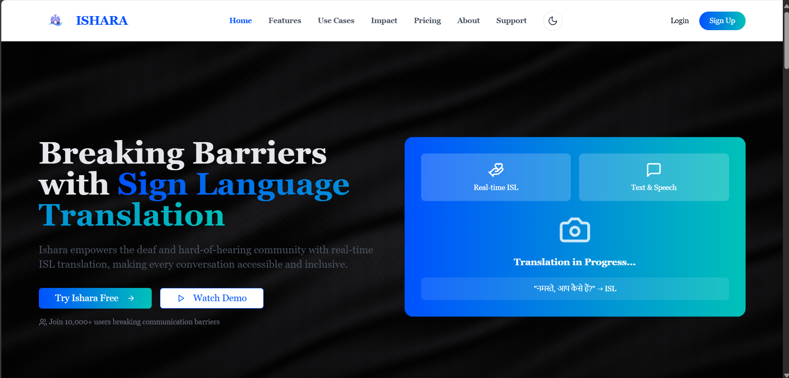
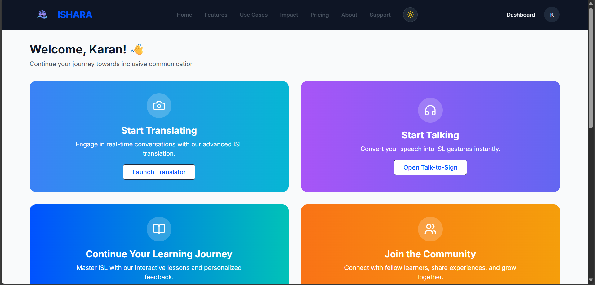
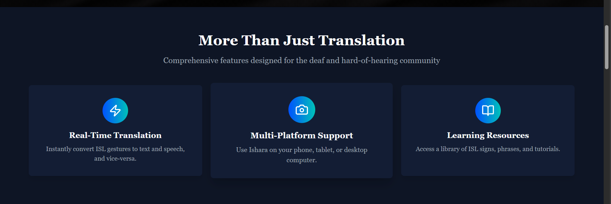
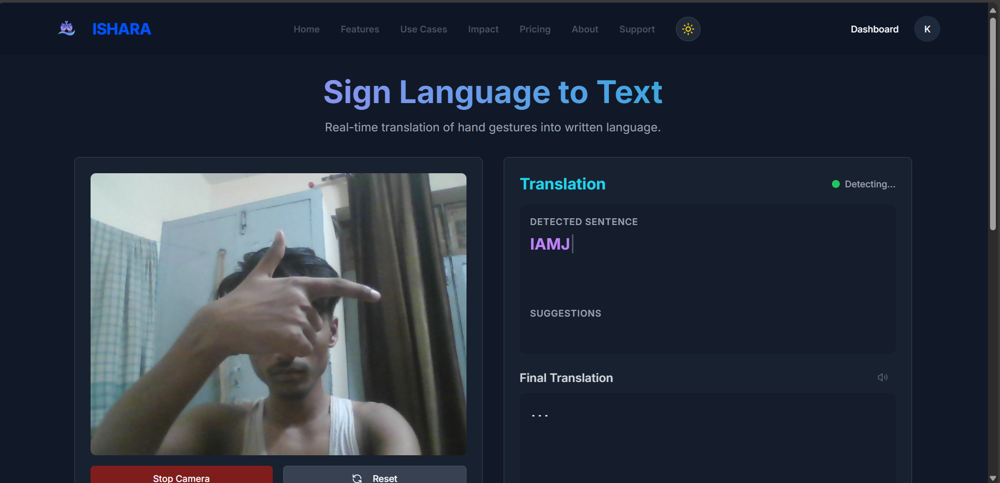
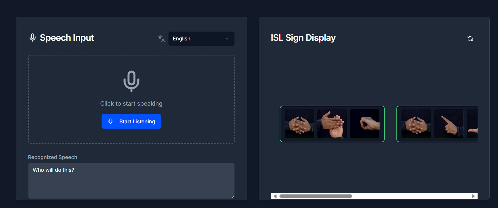
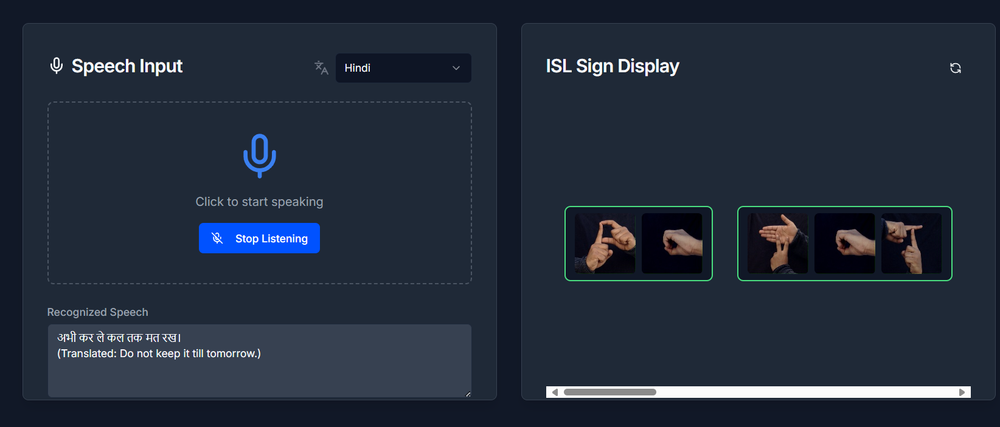
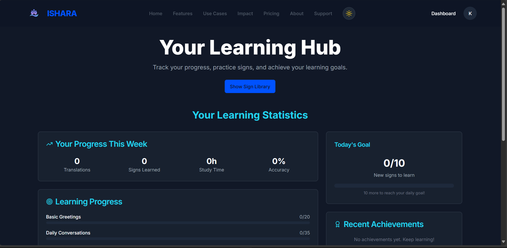
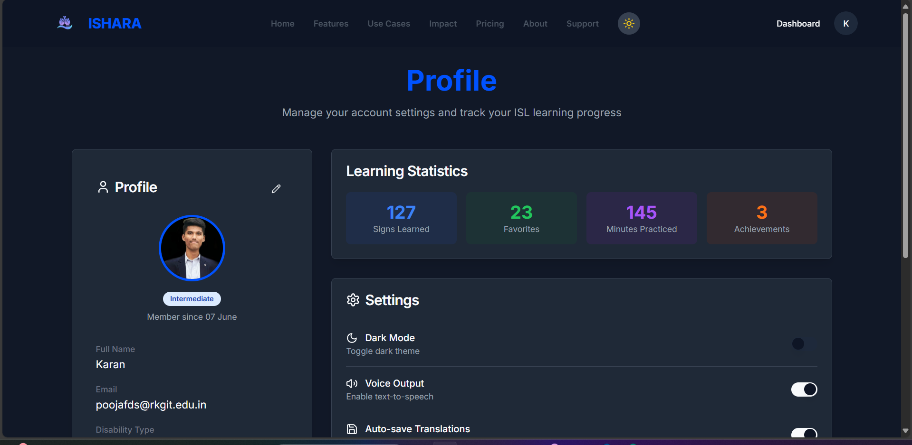
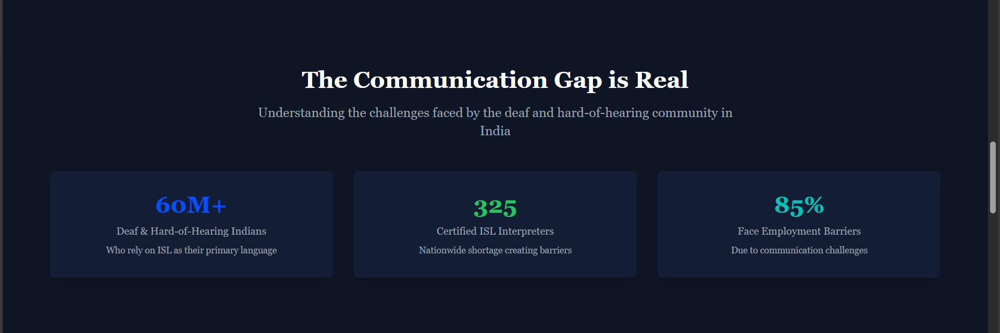

# Indian Sign Language Translator #

<Empowering communication for millions through AI-powered Indian Sign Language (ISL) recognition>
----------------------------------------------------------------------------------------------------------------------------------------------------------------------------------------------------------------------------------------------------------

🧩 **Problem Statement**

Millions of individuals in India with hearing and speech impairments face communication barriers daily. While American Sign Language (ASL) has been extensively researched and supported by technology, Indian Sign Language (ISL) lacks such development.
Our mission is to build a real-time, user-friendly ISL Translator that:

1.Recognizes ISL gestures using a standard webcam (no gloves, Kinect, or special hardware)

2.Bridges the gap between ISL users and non-signers

3.Promotes ISL learning and inclusivity

----------------------------------------------------------------------------------------------------------------------------------------------------------------------------------------------------------------------------------------------------------

🧠 **Approach & Solution**

For this problem We are presenting ISHARA 

Despite limited datasets and language variation across regions, we aim to:

1.Collect and curate ISL gesture data from internet sources

2.Apply state-of-the-art ML algorithms like CNN and LSTM for gesture classification

3.Use computer vision techniques for real-time gesture detection

Build an end-to-end system that supports sign-to-text/speech and text/speech-to-sign translation

----------------------------------------------------------------------------------------------------------------------------------------------------------------------------------------------------------------------------------------------------------

📸 Screenshots

### 🧑‍💼 About ISHARA

### 🏠 Home Page

### 🖥️ Dashboard

### 🚀 Features

### 🤖 Implement Sign to Text

### 🔊 Voice to Sign - UI

### 📘 Learning Page

### 👤 Profile

### 💡 USP (Unique Selling Point)

----------------------------------------------------------------------------------------------------------------------------------------------------------------------------------------------------------------------------------------------------------

🧩 **Core Components**

Feature	Description

✋ Sign-to-Text/Speech	Real-time detection of hand gestures via webcam and conversion to text or audio

🗣️ Speech/Text-to-Sign	Converts spoken or typed language into ISL using animated sign representations

📚 Learn ISL	Visual reference of static gestures (A–Z, 1–9) to promote ISL literacy

----------------------------------------------------------------------------------------------------------------------------------------------------------------------------------------------------------------------------------------------------------

✨ **Key Features**

🔤 Real-Time Gesture Detection with OpenCV and deep learning

🗣️ Sign Language to Text & Speech Conversion

📢 Text/Speech to ISL Gesture Animation

📚 Interactive ISL Learning Module

🌐 Multilingual Support using Google Translate API

----------------------------------------------------------------------------------------------------------------------------------------------------------------------------------------------------------------------------------------------------------

🛠️ **Tech Stack**

| Technology               | Description                                     |
| ------------------------ | ----------------------------------------------- |
| **Python**               | Core backend logic, model integration           |
| **OpenCV**               | Real-time camera input and frame processing     |
| **YOLOv8**               | Sign detection using object detection           |
| **CNN**                  | For Gesture Recognization                       |
| **React**                | GUI for user interaction                        |
| **Text-to-Speech**       | Speech output of translated signs               |
| **Speech Recognition**   | Converts user voice to text                     |
| **Google Translate API** | Translates voice to English for sign output     |
| **Pickle**               | Saves model encoders and configurations         |
| **Keras / TensorFlow**   | Deep learning framework for training            |

----------------------------------------------------------------------------------------------------------------------------------------------------------------------------------------------------------------------------------------------------------

🙏 **Acknowledgments**

This project is a small but significant step toward inclusive communication and digital accessibility for the hearing and speech impaired community in India.

----------------------------------------------------------------------------------------------------------------------------------------------------------------------------------------------------------------------------------------------------------

📬 **Feedback & Contributions**

Feel free to fork, improve, or suggest features. Let's make ISL more accessible together!
